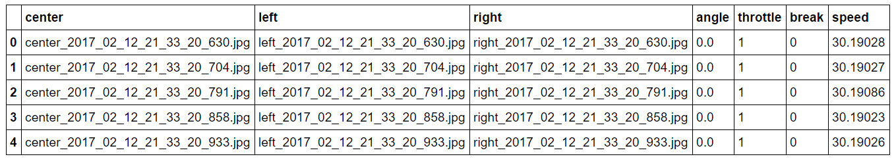
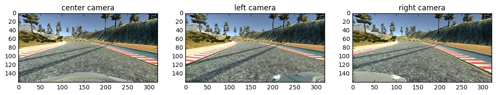
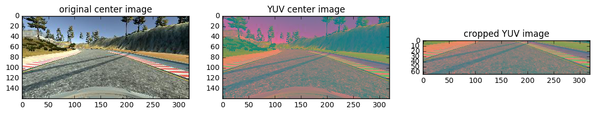

# Behavioral Cloning [](http://www.udacity.com/drive)

This is my solution of Project 3 of Udacity's Self Driving Car Nanodegree.  

### Goals & steps of the project
* Use the simulator to collect data of good driving behavior
* Build, a convolution neural network in Keras that predicts steering angles from images
* Train and validate the model with a training and validation set
* Test that the model successfully drives around track one without leaving the road
* Summarize the results with a written report

### Project files
|filename|description
|---|---|
|[model.py](./model.py)|containing the script to create and train the model|
|[drive.py](./drive.py)|for driving the car in autonomous mode|
|[model.h5](./model.h5)|containing a trained convolution neural network|
|[video.mp4](./video.mp4)|video recording in autonomous mode

### Autonomous mode

To drive the car in autonomous mode you need to run the autopilot. You do this by running the following command:

```sh
python drive.py model.h5
```

Software dependencies: [CarND-Term1-Starter-Kit](https://github.com/udacity/CarND-Term1-Starter-Kit)

### Collecting training data





### Model Architecture

My model is a multilayer convolutional neuronal network, inspired by NVIDA's [End to End Learning for Self-Driving Cars](https://images.nvidia.com/content/tegra/automotive/images/2016/solutions/pdf/end-to-end-dl-using-px.pdf) paper. Most parts of the network are the same. I made only a few changes.

First difference is the input layer. I use a 160x320x3 image, that is cropped 70 pixels from the top and 25 pixels from the bottom. These parts of the image are the sky and the car, which are not importent for navigating on track. The importent part is in the middle of the picture. As you see I still use YUV color converting for input images.



These are the final layers of my model:

| Layer         		|     Description	        					| Input |Output| 
|:---------------------:|:---------------------------------------------:| :----:|:-----:|
| Cropping2D		   	| Crop uninteresting parts of image (70 top, 25 bottom) 	|**160x320x3**|65x320x3|
| Lambda				| Normalize data 										|65x320x3|65x320x3|
| Convolution2D 	    | 5x5 kernel, 2x2 stride, valid padding, ELU activation |65x320x3|31x158x24|
| Convolution2D			| 5x5 kernel, 2x2 stride, valid padding, ELU activation |31x158x24|14x77x36|
| Convolution2D			| 5x5 kernel, 2x2 stride, valid padding, ELU activation |14x77x36|5x37x48|
| Convolution2D			| 3x3 kernel, valid padding, ELU activation 			|5x37x48|3x35x64|
| Convolution2D			| 3x3 kernel, valid padding								|3x35x64|1x33x64|
| Dropout				| 20 %	to prevent overfitting							|1x33x64|1x33x64|
| ELU					| Activation function									|1x33x64|1x33x64|
| Fully connected		| Flatten + connect all neurons from layer above, ELU activation|2112|100|
| Fully connected		| Connect all neurons from layer above, ELU activation	|100|50|
| Fully connected		| Connect all neurons from layer above, ELU activation  |50|10|
| Fully connected		| Output = steering wheel angle 						|10|**1**|

The data is normalized with the Keras lambda layer. 

I tried different avtivation functions, ELU works best for me. 

To prevent overfitting I added Dropout layer after the 5 convolutional layers. Dropout rate is 20 %.

### Training

Epochs = 3

The model used an adam optimizer, so the learning rate was not tuned manually


### Video - Autonomous driving

[](http://www.youtube.com/watch?v=J6EGMKN2kL0 "Autonomous driving")

### Recources
* Self-Driving-Car Simulator: [Linux](https://d17h27t6h515a5.cloudfront.net/topher/2017/February/58ae46bb_linux-sim/linux-sim.zip), [macOS](https://d17h27t6h515a5.cloudfront.net/topher/2017/February/58ae4594_mac-sim.app/mac-sim.app.zip), [Windows](https://d17h27t6h515a5.cloudfront.net/topher/2017/February/58ae4419_windows-sim/windows-sim.zip), [Source](https://github.com/udacity/self-driving-car-sim)
* Python Environment: [CarND-Term1-Starter-Kit](https://github.com/udacity/CarND-Term1-Starter-Kit)
* Nvidia paper: [End to End Learning for Self-Driving Cars](https://images.nvidia.com/content/tegra/automotive/images/2016/solutions/pdf/end-to-end-dl-using-px.pdf)
* Commaai: [Learning a Driving Simulator](https://github.com/commaai/research) 
* Project specification: [Udacity Rubrics](https://review.udacity.com/#!/rubrics/432/view)
* Udacity repository: [CarND-Behavioral-Cloning-P3](https://github.com/udacity/CarND-Behavioral-Cloning-P3)
* [Udacity Self Driving Nanodegree](http://www.udacity.com/drive)
